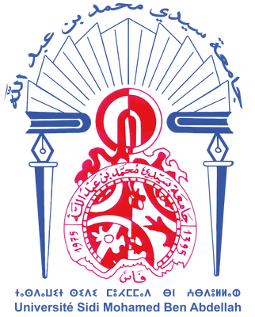
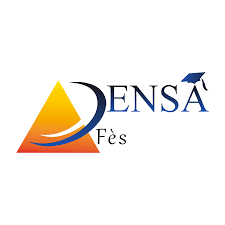

<table width="100%">
  <tr>
    <td width="20%" align="left">
      
    </td>
    <td align="center">
      <h1>Hi 👋, I'm Khadija</h1>
      
<strong>Software Engineering student</strong>

    </td>
    <td width="20%" align="right">
      
    </td>
  </tr>
</table>

---

Software Engineering student with a strong interest in modern technologies
I enjoy building, learning, and improving step by step through real practice.

I mainly work on full-stack development, with a solid foundation in programming, data, and system design.

---

## What I’m currently focused on
Strengthening my engineering skills, clean code practices, and software architecture through hands-on experience.

---

## Collaboration
I enjoy working in teams, sharing ideas, and contributing to collaborative and open-source projects.

---

## Languages and Tools

  

**Tech stack and skills**
- Programming languages: Python, Java, C, C++, C#
- Web development: Angular, React, Spring Boot
- Databases and query languages: SQL, CQL, MQL, Cypher
- Data and analysis: NumPy, Excel, data visualization
- Software design: UML, object-oriented design, data modeling
- Systems: Windows, Linux
- Tools: Git, GitHub

---

## How to reach me
- LinkedIn: https://www.linkedin.com/in/khadija-alaoui-mrani-28633a334
- GitHub: https://github.com/Khadija2005J
- Email: your.email@example.com

---

## Fun facts
I often start coding with a simple idea and enjoy improving it step by step.
